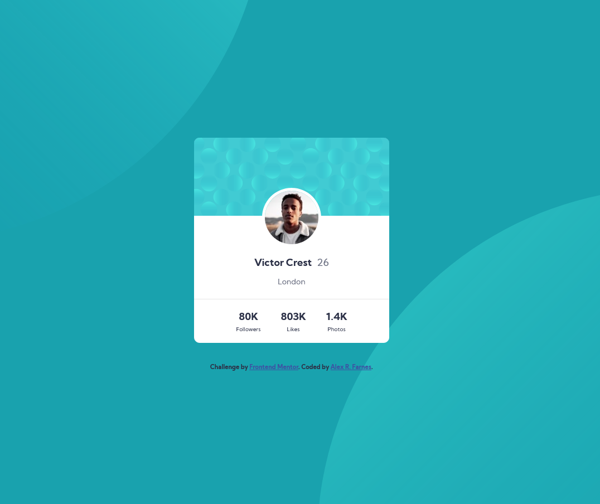

# Frontend Mentor - Profile card component solution

This is a solution to the [Profile card component challenge on Frontend Mentor](https://www.frontendmentor.io/challenges/profile-card-component-cfArpWshJ). Frontend Mentor challenges help you improve your coding skills by building realistic projects. 

## Table of contents

- [Overview](#overview)
  - [The challenge](#the-challenge)
  - [Screenshot](#screenshot)
  - [Links](#links)
- [My process](#my-process)
  - [Built with](#built-with)
  - [What I learned](#what-i-learned)
  - [Continued development](#continued-development)
- [Author](#author)

**Note: Delete this note and update the table of contents based on what sections you keep.**

## Overview

### The challenge

- Build out the project to the designs provided

### Screenshot

### Links

- Solution URL: [Github]()
- Live Site URL: [Live Demo]()

## My process

### Built with

- Flexbox
- Mobile-first workflow
- [Sass](https://sass-lang.com/) - CSS preprocessor
- [BEM](http://getbem.com/introduction/) - CSS architecture

### What I learned

I used this project to practice my layout skills with flexbox. I used these opportunity to learn and practice the use of a CSS preprocessor Sass. Although this is a small component, I also wanted to use the BEM methodology to practice it and see if I like it.

### Continued development

In future projects I want to keep practicing Sass and learn more advance features that can help me speed up the process. 

## Author

- Github - [AlexRFarnes](https://github.com/AlexRFarnes)
- Frontend Mentor - [@AlexRFarnes](https://www.frontendmentor.io/profile/AlexRFarnes)
- Twitter - [@alexrfarnes](https://www.twitter.com/alexrfarnes)
